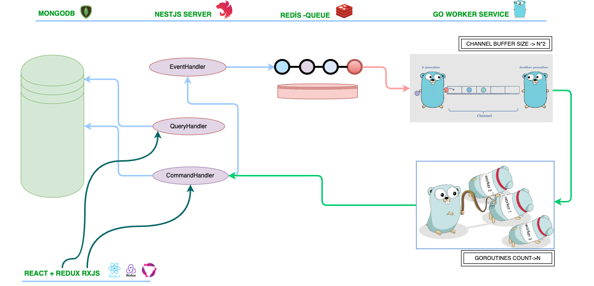
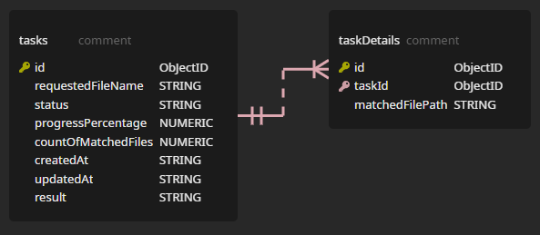

<h1 align="center">
  <br>
  </a>
  <br>
  GOFIND
  <br>
</h1>


<h4 align="center"> A simple file search system. It searchs the given words, in the file names through the given directory and subdirectories. </h4>

<p align="center">
  <a href="">  </a>
  <a href=""></a>
  <a href=""></a>
  <a href=""></a>
</p>

<p align="center">
  <a href="#work-flow">Work Flow</a> •
  <a href="#how-to-use">How To Use</a> • 
  <a href="#docker">Docker</a> 
</p>

<br>
  </a>
<br>


## Work Flow

- User creates a task by making a POST request to NestJSApp.
- Command Handler adds requestedFileName to the MongoDB's filesearchtasks collection and gets inserted id.
- Event Handler adds requestedFileName and inserted id to Redis Queue.
- Inserted id is returned to user as server response.
- Search directory and the count of goroutines that will work simultaneously must be decided before the GoApp start to work.
- On start, GoApp firstly walks through the search directory and all subdirectories/files (except non permissioned ones) to decide
  percentage increment rate. This operation may take time according to total count of files and directories.
- GoApp listens Redis Queue and puts the data to a buffered go channel. Buffered channel's capacity is twice of total goroutines count.
- When percentage increment rate is determined, N goroutines start to listen buffered channel.
- Goroutines take the task from channel, walk through the paths/files and update/insert mongoDB collections simultaneously. They never block each other.

<br>
  </a>
<br>

- Whenever a goroutine finishes its work, it again starts to listen the buffered channel, this continues as a loop through the main goroutines life time.
- Multiple search requests are processed simultaneously.
- User can track the flow by making GET requests to NestjsApp with a task id (id that was sent as the POST operation's response) and a page number. 
  For pagination and performance issues, max up to 50 results are shown per request.
  
  
  
## How To Use

To clone and run this application, you'll need [Git](https://git-scm.com) and [Node.js](https://nodejs.org/en/download/) (which comes with [npm](http://npmjs.com)) and [Golang](https://go.dev/dl/) installed on your computer. From your command line:

```bash
# Clone this repository
$ git clone https://github.com/CaganPamir/nestjs-golang-filesearch.git

# Go into the repository
$ cd nestjs-golang-filesearch

# Run Redis and MongoDB                       (PS ....nestjs-golang-filesearch>)
$ docker-compose -f docker-compose.yml up -d  

# Install dependencies for GoApp              (PS ....nestjs-golang-filesearch>)
$ go mod download

# Open config.json                            (PS ....nestjs-golang-filesearch\golang-app\bin>)     
# Set the search directory (SEARCH_ROOTPATH) and count of goroutines that will work simultaneously (GOROUTINE_COUNT)

# Build the GoApp                             (PS ....nestjs-golang-filesearch>)
$ go build -o .\golang-app\bin\  .\golang-app\cmd\filesearch-worker\. 

# Run GoApp                                   (PS ....nestjs-golang-filesearch>)
$ .\golang-app\bin\filesearch-worker 

# Open New Terminal
# Go into the nest project                    (PS ....nestjs-golang-filesearch>)
$ cd nestjs-server 

# Install dependencies                        (PS ....nestjs-golang-filesearch\nestjs-server>)
$ npm install -g  @nestjs/cli
$ npm install 

# Run NestJSApp                                (PS ....nestjs-golang-filesearch\nestjs-server>)
$ npm run start:dev

```

> **Note**
- Create a task with [Swagger](http://localhost:3000/api)
- Or use **nestjs-filenamesearch.postman_collection.json** file      (PS ....nestjs-golang-filesearch\assets\postman>)

## Docker

GOFIND is very easy to install and deploy in a Docker container:

```bash
# Run Redis and MongoDB                       (PS ....nestjs-golang-filesearch>)
# after this command mongo-network will be created
$ docker-compose -f docker-compose.yml up -d  

# Build GoApp  image                          (PS ....nestjs-golang-filesearch>)
$ docker build  -t go-dock:version_1 .  

# Run GoApp image as a container                 
$ docker run -d -p 5000:5000 --net mongo-network --name mygo go-dock:version_1 

# Build NestJSApp image                       (PS ....nestjs-golang-filesearch\nestjs-server>)
$ docker build -t myfirstnestjsapp:version_1 .

# Run NestJSApp image as a container                 
$ docker run -d -p 3000:3000 --net mongo-network --name mynest myfirstnestjsapp:version_1 

```

> **Note**
- GoApp container must be mounted to the file system that it will search
- Time Zones must be configured while creating Go and NestJS containers
